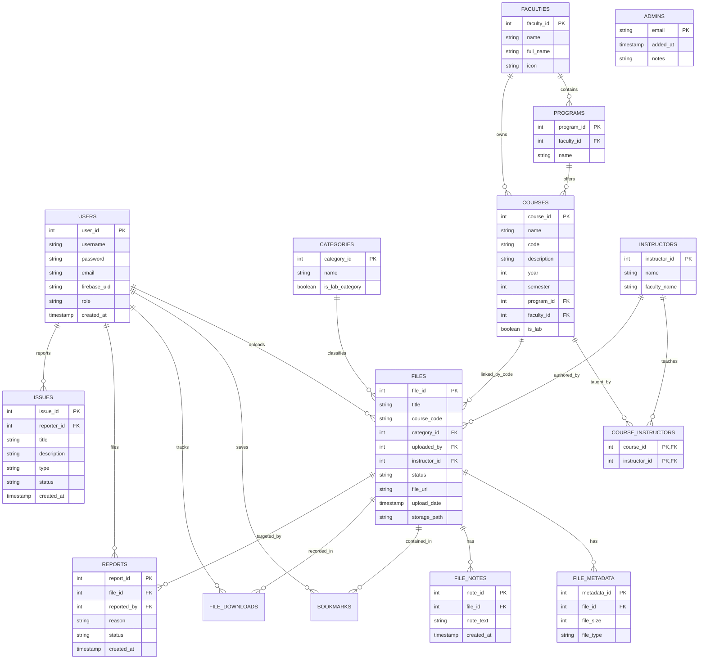

# GIKI Course Hub Database Schema

This document provides a detailed overview of the GIKI Course Hub database architecture. The system uses a PostgreSQL database with a normalized structure to manage users, courses, materials, and administrative operations.

## 1. Entity Relationship Diagram (ERD)

## 2. Table Definitions

### 2.1. Identity & Access Control
#### `users`
Stores user profile information. Supports both local (email/password) and Firebase authentication.
- `user_id`: Auto-incrementing primary key.
- `username`: Unique display name for the user.
- `password`: Hashed password (can be null if the user only uses Firebase).
- `email`: Unique email address.
- `firebase_uid`: Unique identifier provided by Firebase Auth.
- `role`: Access level, either `user` or `admin`.
- `created_at`: Timestamp when the account was created.

#### `admins`
A whitelist of emails that are granted administrative access to the platform.
- `email`: The email address (Primary Key).
- `added_at`: When this email was added to the admin list.
- `notes`: Internal notes regarding the admin account.

### 2.2. Academic Organization
#### `faculties`
High-level academic divisions within GIKI (e.g., FCSE, FEE).
- `faculty_id`: Primary Key.
- `name`: Short unique identifier (e.g., 'FCSE').
- `full_name`: Official descriptive name.
- `icon`: Identifier for UI icons/emojis.

#### `programs`
Degrees or tracks offered by a faculty (e.g., BS Computer Science).
- `program_id`: Primary Key.
- `faculty_id`: Reference to the parent faculty.
- `name`: Name of the program.

#### `courses`
Specific subjects taught within programs.
- `course_id`: Primary Key.
- `name`: Official course title.
- `code`: Unique alphanumeric code (e.g., 'CS101').
- `description`: Overview of the course content.
- `year`: The academic year the course is typically taken (1-4).
- `semester`: The specific semester (1-8).
- `program_id`: Link to the primary program it belongs to.
- `faculty_id`: Link to the owning faculty.
- `is_lab`: Boolean flag indicating if this is a laboratory-based course.

### 2.3. Faculty & Staffing
#### `instructors`
Academic staff members.
- `instructor_id`: Primary Key.
- `name`: Full name of the instructor.
- `faculty_name`: The faculty they primarily belong to.

#### `course_instructors`
Links instructors to the specific courses they teach.
- `course_id`: Reference to the course.
- `instructor_id`: Reference to the instructor.
- Composite Primary Key of `(course_id, instructor_id)`.

### 2.4. Content & Materials
#### `categories`
Classifies the type of materials uploaded (e.g., Slides, Past Papers).
- `category_id`: Primary Key.
- `name`: Unique name of the category.
- `is_lab_category`: Flag to show if this category is only for lab courses (e.g., 'Lab Manuals').

#### `files`
The main table for all academic materials uploaded by users.
- `file_id`: Primary Key.
- `title`: User-provided title for the file.
- `course_code`: References the `code` in the `courses` table.
- `category_id`: Type of material.
- `uploaded_by`: Reference to the user who uploaded the file.
- `instructor_id`: Optional reference to the specific instructor for this version of the material.
- `status`: Moderation status (`pending`, `approved`, `rejected`).
- `file_url`: Direct URL to the file (e.g., Cloudflare R2).
- `storage_path`: Internal identifier for the storage backend.
- `upload_date`: Timestamp of the upload.

#### `file_metadata`
Technical details about the physical file.
- `file_id`: Reference to the parent file.
- `file_size`: Size in bytes.
- `file_type`: Extension or MIME type.

#### `file_notes`
Internal or public notes attached to a file submission.
- `file_id`: Reference to the parent file.
- `note_text`: Content of the note.

### 2.5. Social & Interaction
#### `bookmarks`
Allows users to save files to their personal collection.
- `user_id`: The user who bookmarked the file.
- `file_id`: The file being saved.

#### `file_downloads`
An audit trail of every time a file is accessed/downloaded.
- `file_id`: The file that was downloaded.
- `user_id`: The user who performed the action (nullable for guests).
- `downloaded_at`: Timestamp of the event.

### 2.6. Feedback & Moderation
#### `reports`
User reports flagged against specific files for issues like wrong category or bad quality.
- `file_id`: The flagged file.
- `reported_by`: The user filing the report.
- `reason`: Explanation of the issue.
- `status`: Moderation state (`pending`, `resolved`, `dismissed`).

#### `issues`
General platform feedback, bugs, or feature requests.
- `reporter_id`: User who submitted the issue.
- `title`: Short summary.
- `description`: Detailed feedback.
- `type`: Category of the issue (e.g., 'bug', 'ui').
- `status`: Current state of the issue.
