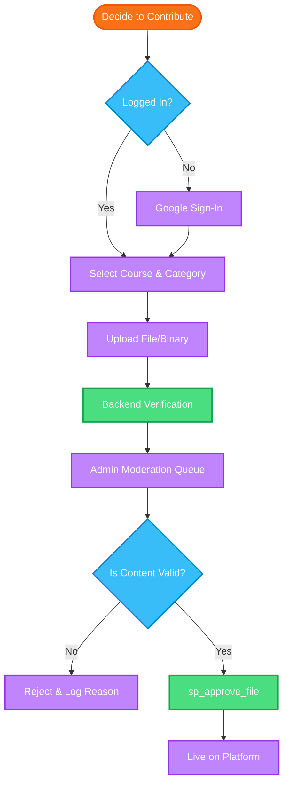
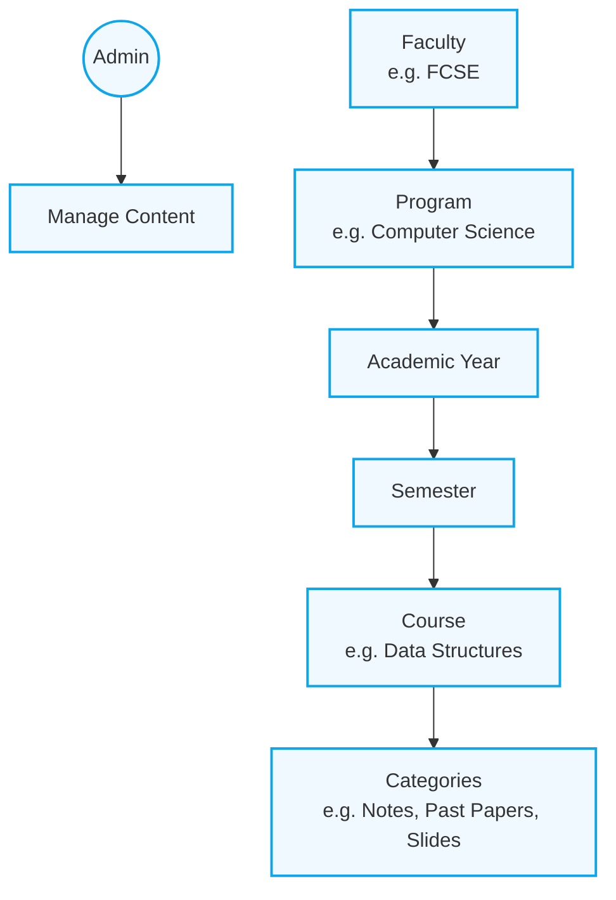

# GIKI Course Hub - Project Flowcharts

This document illustrates the logical flow of the GIKI Course Hub platform, following standard flowchart conventions.

## 1. Main Student User Journey
This flowchart shows the process from opening the platform to accessing course materials.

## 2. Contribution & Moderation Flow
This flowchart shows how student contributions are handled by the system and administrators.

## 3. Platform Hierarchy
A high-level view of how data is organized within the system.

