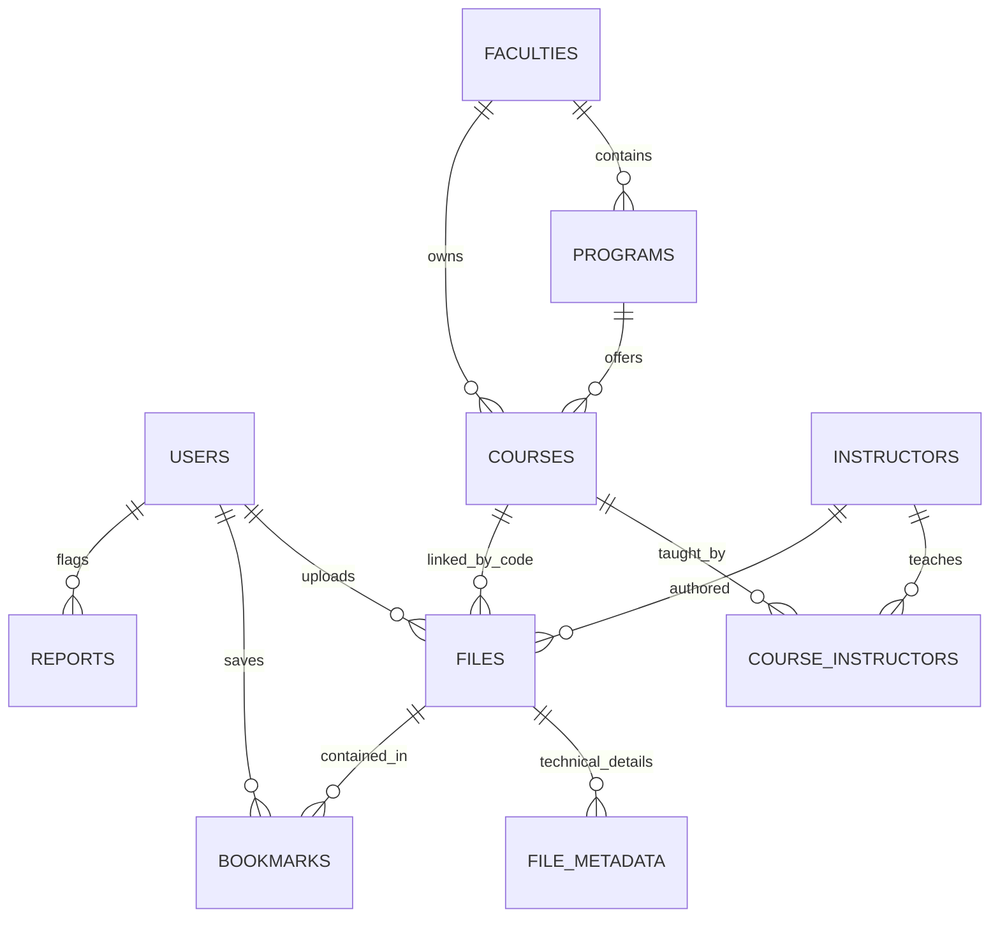

# 🏛️ GIKI Course Hub: Full Technical & Architectural Specification

This document provides a comprehensive technical breakdown of the GIKI Course Hub platform. It covers the system's infrastructure, database schema, server-side logic, and frontend integration.

---

## 🔗 System Access & Deployment

| Component | Environment | URL |
|:---|:---|:---|
| **Frontend** | Production (Vercel) | [https://frontend-xi-pink-10.vercel.app](https://frontend-xi-pink-10.vercel.app) |
| **API Backend** | Production (Render) | [https://giki-course-hub-backend.onrender.com](https://giki-course-hub-backend.onrender.com) |
| **Database** | PostgreSQL | Hosted on Supabase |
| **Storage** | Cloudflare R2 | S3-Compatible Object Store |

---

## 🛠️ 1. Technical Stack (The "Why")

- **React (Vite)**: Chosen for rapid state management and high-performance UI rendering.
- **Flask (Python)**: Provides a lightweight, flexible REST API layer with excellent PostgreSQL integration.
- **PostgreSQL**: Used for complex relational data and JSONB processing.
- **Firebase Auth**: Industry-standard Identity Provider (IdP) for secure Google Authentication.
- **Cloudflare R2**: Secure, cost-effective object storage for binary course materials.

---

## 📊 2. Database Inventory (Raw Tables & Components)

### 📂 Tables & Purpose
| Table Name | Note / Technical Role |
|:---|:---|
| **`users`** | Identity mapping; links local roles to Firebase UIDs. |
| **`faculties`** | Primary organizational entities. |
| **`programs`** | Secondary academic entities; child of faculties. |
| **`courses`** | Resource containers; stores metadata (Code, Semester, Year). |
| **`categories`** | UI classification tags; toggles view logic via `is_lab_category`. |
| **`instructors`** | Directory of academic entities for material attribution. |
| **`course_instructors`** | Many-to-many junction table for course-teacher mapping. |
| **`files`** | Main object registry; tracks status, URLs, and storage keys. |
| **`file_metadata`** | Technical properties of binary objects (Size, Type). |
| **`file_notes`** | Persistent administrative annotations for specific files. |
| **`bookmarks`** | User-specific collection mappings for saved resources. |
| **`file_downloads`** | Analytics log for tracking platform usage metrics. |
| **`admins`** | Access Control List (ACL) for administrative permissions. |
| **`reports`** | User-generated moderation tickets for content quality. |
| **`issues`** | Platform-wide bug and feature request tracking. |
| **`admin_logs`** | Immutable audit trail for all administrative write-operations. |

---

## ⚙️ 3. Server-Side Logic (Functions & Procedures)

### 🧩 PL/pgSQL Functions
*   **`get_api_courses_hierarchy()`**: Aggregates 4 hierarchical levels into a single JSON tree to minimize round-trips.
*   **`get_api_course_files(id)`**: Fetches materials grouped by category ID for optimized tab rendering.

### 📜 Stored Procedures
*   **`sp_approve_file(id, email)`**: Atomic transaction for status updates with automatic audit logging.
*   **`sp_delete_course_files(code)`**: Batch processing utility for resource cleanup.

### 🖼️ Database Views
*   **`vw_approved_materials`**: Pre-joined data projection for public-facing resource feeds.
*   **`vw_user_activity`**: Summary metrics (uploads/bookmarks) for dashboard display.

---

## ⚡ 4. Performance & Integrity

### 🎯 Database Indexes
- **`idx_files_course_code`**: B-Tree index for optimized code-based resource lookups.
- **`idx_files_category`**: Speeds up category-specific filtering.
- **`idx_files_instructor`**: Optimizes JOINs and filtering by instructor identifier.

### 🛡️ System Triggers
- **`user_profiles_updated_at`**: Automates the maintenance of `updated_at` timestamps on row modification.

---

## 💻 5. Frontend-to-Backend Mapping

| React Screen | Backend Operation | DB Logic Used |
|:---|:---|:---|
| `Courses.jsx` | Load Catalog | `get_api_courses_hierarchy()` |
| `CoursePage.jsx` | Fetch Files | `get_api_course_files(id)` |
| `AdminPanel.jsx` | Moderation | `sp_approve_file` |
| `GlobalSearch.jsx`| Universal Search| `ILIKE` on indexed `course_code` |
| `Bookmarks.jsx` | Personal Collection| `bookmarks` JOIN `files` |

---

## 📐 6. System Connections (ERD)

---

*Document Last Updated: May 2026*
*Status: Verified Production Specification*
