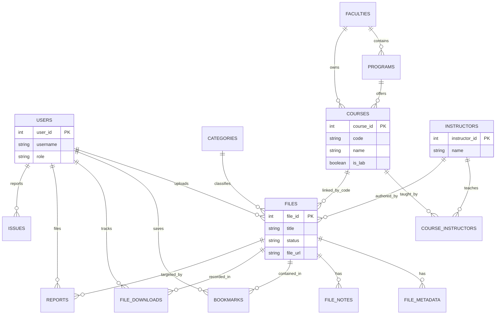

# GIKI Course Hub - System Documentation

Welcome to the comprehensive documentation for the **GIKI Course Hub**. This document details the technical architecture, database relationships, core functionalities, and live deployment links.

---

## 🔗 Live Deployment Links

| Environment | Component | URL |
|---|---|---|
| **Production** | Frontend (Vercel) | [https://frontend-xi-pink-10.vercel.app](https://frontend-xi-pink-10.vercel.app) |
| **Production** | API Backend (Render) | [https://giki-course-hub-backend.onrender.com](https://giki-course-hub-backend.onrender.com) |
| **Database** | PostgreSQL | Hosted on Supabase (Private) |
| **File Storage** | Cloudflare R2 | S3-Compatible (Private) |

---

## 🛠 Tech Stack

- **Frontend**: React (Vite), Axios, React Router, Vanilla CSS (Premium Glassmorphism Design).
- **Backend**: Flask (Python 3.11), Gunicorn.
- **Database**: PostgreSQL (Supabase).
- **Authentication**: Firebase Admin SDK (Google Auth) + Local Session Management.
- **Storage**: Cloudflare R2 (S3-Compatible) for course materials.
- **Deployment**: Vercel (Frontend) & Render (Backend).

---

## ✨ Features & Functionalities

### 1. User Experience
- **Universal Search**: Real-time global search for courses and materials by name, code, or instructor.
- **Dynamic Catalog**: Browse courses by Faculty (FCSE, FEE, etc.), Program, Year, and Semester.
- **Course Detail Pages**: Dynamic tabs for different material categories (Notes, Papers, Slides, etc.).
- **Lab Course Detection**: Automatically switches categories (e.g., adding "Lab Manuals") for courses marked as `is_lab`.
- **Bookmarks**: Logged-in users can save files for quick access in their dashboard.

### 2. Material Management
- **File Uploads**: Users can upload PDF/DOCX materials, assigning them to categories and instructors.
- **Smart Categorization**: Files are automatically organized based on the course code and category ID.
- **Storage Abstraction**: Files are securely streamed to Cloudflare R2 to ensure zero load on the web server.

### 3. Administrative Controls
- **Moderation Queue**: Admins can review pending uploads, approve them for public view, or reject them.
- **Instructor Management**: Organize instructors by faculty to simplify the upload process.
- **Issue Tracking**: Users can report bugs or broken links, which appear in the Admin Panel for resolution.
- **System Logs**: Track downloads and user activity for platform analytics.

---

## 📐 Database Architecture & Relationships

### Entity Relationship Diagram (ERD)

### Key Relationships Detailed

1.  **Academic Hierarchy**: `Faculties` -> `Programs` -> `Courses`. This cascading relationship ensures that deleting a faculty or program correctly manages child courses.
2.  **Material Linking**: `Files` are linked to `Courses` via the `course_code`. They are also linked to `Categories` (classification) and `Users` (attribution).
3.  **Instructor Mapping**: The `course_instructors` junction table allows for a Many-to-Many relationship between Courses and Instructors, reflecting reality where multiple teachers may teach the same course across different semesters.
4.  **User Interactions**: `Bookmarks` and `File Downloads` create a Many-to-Many link between `Users` and `Files`, tracking personalization and usage metrics.

---

## 📡 API Route Structure

### Authentication (`/auth`)
- `POST /api/auth/register`: Create a local account.
- `POST /api/auth/login`: Session-based login.
- `POST /api/auth/firebase`: Verify Firebase ID tokens for Google Sign-in.
- `POST /api/auth/logout`: Clear session.

### Files & Courses (`/api`)
- `GET /api/catalog`: Retrieve the full nested academic hierarchy.
- `GET /api/search`: Search courses and approved files.
- `GET /api/courses/<id>`: Get specific course details and its approved files.
- `POST /api/upload`: Securely upload a file to Cloudflare R2.
- `POST /api/bookmark`: Toggle bookmark status for a file.

### Admin & Moderation (`/admin`)
- `GET /api/admin/pending`: List all files awaiting moderation.
- `POST /api/admin/approve/<id>`: Approve a file for public view.
- `GET /api/admin/issues`: View user-reported platform issues.
- `GET /api/admin/stats`: Get system-wide stats (total files, users, downloads).

---

## 🚀 Future Roadmap
- **Batch Uploading**: Support for uploading entire folders.
- **AI Summarization**: Automatic generation of summaries for long PDF notes.
- **Community Chat**: Integration of course-specific discussion forums.

*Document Last Updated: May 2026*
